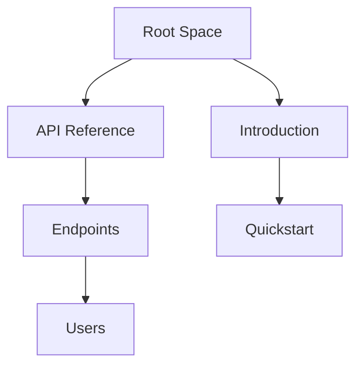

## Overview

Sreelal Pillai provides a flexible platform for managing technical documentation. You organize content into spaces, build hierarchical structures, handle versioning, and control access through permissions. These concepts form the backbone of efficient documentation workflows.

<Callout kind="info">
  Master these fundamentals to streamline collaboration and maintain up-to-date docs.
</Callout>

## Core Concepts

<Columns cols={2}>
  <Card title="Documentation Spaces" icon="book-open" href="#documentation-spaces">
    Isolated environments for projects or teams.
  </Card>
  <Card title="Project Hierarchies" icon="layers" href="#project-hierarchies">
    Nested organization of pages and sections.
  </Card>
  <Card title="Versioning" icon="git-branch" href="#versioning">
    Track changes and publish updates safely.
  </Card>
  <Card title="Permissions" icon="shield" href="#permissions">
    Role-based access control for teams.
  </Card>
</Columns>

## Documentation Spaces

Documentation spaces act as dedicated containers for related content. You create a space for each major project, team, or product line. Each space maintains its own settings, themes, and access rules.

Spaces enable isolation, preventing cross-contamination of content. For example, your API docs live in one space, while user guides occupy another.

```javascript
// API call to create a space
const response = await fetch('https://api.example.com/v1/spaces', {
  method: 'POST',
  headers: { 'Authorization': 'Bearer YOUR_TOKEN' },
  body: JSON.stringify({
    name: 'My Project Docs',
    description: 'Documentation for Project X'
  })
});
```

<ParamField path="name" param-type="string" required="true">
  Unique name for the space.
</ParamField>

<ParamField body="description" param-type="string" required="false">
  Optional description.
</ParamField>

## Project Hierarchies

You structure content hierarchically, mimicking a file tree. Top-level pages branch into subpages, creating intuitive navigation.



This structure supports deep nesting while keeping URLs clean, like `/spaces/myproject/api/endpoints/users`.

## Versioning and Updates

Sreelal Pillai uses semantic versioning for docs. You draft changes in branches, preview them, and merge to production.

<Tabs>
  <Tab title="Draft Workflow" icon="edit-3">
    Create branches for edits without affecting live docs.
    
    <Steps>
      <Step title="Branch" icon="git-branch">
        Fork a version branch.
      </Step>
      <Step title="Edit" icon="pen">
        Update pages and preview.
      </Step>
      <Step title="Merge" icon="git-merge">
        Publish after review.
      </Step>
    </Steps>
  </Tab>
  <Tab title="Rollback" icon="rotate-ccw">
    Revert to previous versions instantly.
    
    ```bash
    curl -X POST https://api.example.com/v1/spaces/myspace/rollback \
      -H "Authorization: Bearer YOUR_TOKEN" \
      -d '{"version": "v1.2.0"}'
    ```
  </Tab>
</Tabs>

<Callout kind="tip">
  Always tag releases with semantic versions like `v2.0.0` for clarity.
</Callout>

## User Permissions Model

Permissions follow a role-based model: Owner, Editor, Viewer. Assign roles at space or page level.

| Role    | Read | Write | Delete | Manage Users |
|---------|------|-------|--------|--------------|
| Owner   | ✅   | ✅    | ✅     | ✅           |
| Editor  | ✅   | ✅    | ❌     | ❌           |
| Viewer  | ✅   | ❌    | ❌     | ❌           |

<ExpandableGroup>
  <Expandable title="Advanced Permissions" default-open="true">
    Use granular controls for nested pages. Owners delegate editors per section.
    
    <CodeGroup tabs="JavaScript,Python">
    ```javascript
    await fetch('https://api.example.com/v1/permissions', {
      method: 'POST',
      body: JSON.stringify({
        spaceId: 'space-123',
        userId: 'user-456',
        role: 'editor'
      })
    });
    ```
    ```python
    import requests
    requests.post('https://api.example.com/v1/permissions',
      json={
        'spaceId': 'space-123',
        'userId': 'user-456',
        'role': 'editor'
      },
      headers={'Authorization': 'Bearer YOUR_TOKEN'}
    )
    ```
    </CodeGroup>
  </Expandable>
</ExpandableGroup>

## Best Practices

Combine these concepts for scalable docs. Start with a space per product, enforce hierarchies, version religiously, and audit permissions quarterly. This setup optimizes your workflow and team collaboration.